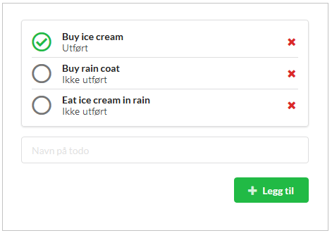

# Oppgave - Fagintervju


## Introduksjon
I denne oppgaven skal det lages en Todo-applikasjon.

Bruker av applikasjonen må kunne: 
- Legge til todo
- Fjerne todo
- Toggle todo status (Utført eller ikke utført)

I grensesnittet skal en kunne klikke på et ikon eller knapp for å endre fra "ikke utført" status til "utført" status, og vice versa. En skal kunne klikke på et ikon eller knapp for å slette et element. Et tekstfelt og en "legg til"-knapp skal være synlig, der en kan legge til nye elementer. Under er et eksempel på hvordan et slikt UI kan se ut.



Applikasjonen må støtte asynkrone handlinger. Grensesnittet må ta høyde for at det tar tid å utføre en handling, f.eks. igjennom å vise en loading-status eller en "spinner" imens dette pågår. 

<div class="page"/>

## "Http"-service
Vi tar utgangspunkt i at hver endring i prinsippet skal lagres på en web-tjener. For å mocke dette, er det laget en falsk service som utfører kall mot en liste av todo's. Denne finner du under `/todoService/index.js`. Metodene her returnerer *Promise*s. For å simulere responstid, kan du endre variabelen `maxSleepMs` i metoden `sleep`, som er maksimum sovetid (f.eks. ved `maxSleepMs = 1000` vil Promise resolves etter mellom 0 til 1000 ms).

Dersom du vil sette opp eget API, er du helt velkommen til å gjøre det - særlig om dette er kunnskap du vil vise frem.

Modellen for en Todo er satt opp på følgende måte: 
```javascript
{
    id: 0,
    title: 'Title',
    completed: false,
}
```

Eksporterte metoder i `todoService`.

```javascript
getTodoById(id: number) : Todo
getTodos() : Todo[]
toggleTodo(todoId: number) : Todo
addTodo(title: string) : Todo
deleteTodo(id: number) : void
```

## Biblioteker og rammeverk
Det tas utgangspunkt i at applikasjonen utvikles ved bruk av *React* og *Redux*. 
For å forenkle asynchronous actions, kan enten *redux-thunk*, *redux-saga* eller andre alternativer tas i bruk etter eget ønske. 

UI-rammeverk som *bootstrap*, *Material UI* og *Semantic UI* er fritt frem å bruke om en vil (... men det er selvfølgelig også lov å skrive egen styling).

Utover dette er det helt valgfritt hvilke biblioteker en ønsker å ta i bruk. Er det noe du kan og vil vise frem, så er det fritt fram. (F.eks. om du er knallgod på *styled-components*, eller skriver råbra *jest*-tester.). Det viktigste her er at du viser hva du kan best. 

<div class="page"/>

## Eksempler
### Bruk av fake *todoService* i en Action Creator

```javascript
import todoService from '../todoService';
import { ... } from "./todo.constants";

export const getTodos = () => dispatch => {
    dispatch({ type: GET_TODOS_STARTED });

    todoService.getTodos().then(todos => {
        dispatch({
            type: GET_TODOS_SUCCESS,
            payload: todos
        });
    }).catch(() => {
        dispatch({ type: GET_TODOS_ERROR });
    });
}

```
Eller med ES6 try / catch

```javascript
import todoService from '../todoService';
import { ... } from "./todo.constants";

export const getTodos = () => async (dispatch) => {
    dispatch({ type: GET_TODOS_STARTED });
    try {
        var todos = await todoService.getTodos();
        dispatch({
            type: GET_TODOS_SUCCESS,
            payload: todos
        });
    } catch (error) {
        dispatch({ type: GET_TODOS_ERROR });
    }
};
```

## Oppsett
`todo-app` som ligger vedlagt er satt opp ved bruk av `create-react-app`. For å sette i gang med utvikling, kjør `yarn install` + `yarn start` eller `npm install` + `npm start` inne i katalogen. 